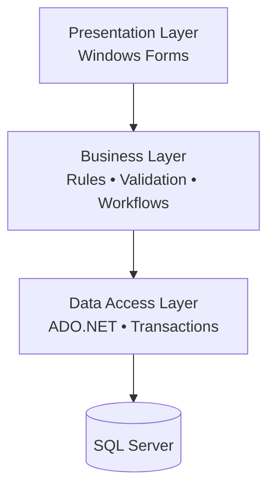

# 🚗 DVLD Management System
**Windows Desktop Application – .NET | SQL Server**

## 📌 Overview
The **DVLD Management System** is a full-scale **Windows Desktop Application** that simulates real-world operations of a **Driving License & Vehicle Department**.

The system is designed as a **production-level administrative application**, focusing on:
- Clean and scalable architecture
- Strong separation of concerns
- Robust validation and data integrity
- Maintainability and long-term scalability

This is not a simple CRUD project.  
It represents a **real governmental-style desktop system** with complex workflows and strict business rules.

---

## ❓ Problem Statement
Many desktop applications suffer from:
- Mixing UI logic with business logic and database access
- Weak validation and poor error handling
- Difficult maintenance and scalability
- Lack of workflow control and traceability
- Absence of logging and monitoring

This project was built to solve these problems by applying **proper layered architecture** and **clean software engineering principles** from the ground up.

---

## 🧱 System Architecture

### 🔹 3-Layered Architecture Diagram



## 🧱 Layer Responsibilities

### 🔹 Presentation Layer
- Windows Forms user interface  
- Handles user interaction and input only  
- No business logic  
- No direct database access  

---

### 🔹 Business Layer
- Core business rules  
- Centralized validation logic  
- License lifecycle management  
- Application and workflow processing  

---

### 🔹 Data Access Layer
- SQL Server access using ADO.NET  
- Parameterized queries  
- Transaction-based operations (Commit / Rollback)  
- Secure and centralized data handling  

```
DVLD/
│
├── PresentationLayer/
│   │
│   ├── Applications/
│   │   ├── Application Types/
│   │   │   ├── frmEditApplicationType.cs
│   │   │   └── frmListApplicationTypes.cs
│   │   │
│   │   ├── Controllers/
│   │   │   ├── ctrlApplicationBasicInfo.cs
│   │   │   └── ctrlDrivingLicenseApplicationInfo.cs
│   │   │
│   │   ├── Local Driving License/
│   │   │   ├── frmAddUpdateLocalDrivingLicenseApplication.cs
│   │   │   ├── frmListLocalDrivingLicenseApplications.cs
│   │   │   ├── frmLocalDrivingLicenseApplicationInfo.cs
│   │   │   ├── frmRenewLocalDrivingLicenseApplication.cs
│   │   │   └── frmReplaceLostOrDamagedLicenseApplication.cs
│   │   │
│   │   └── International License/
│   │       ├── frmListInternationalLicenseApplications.cs
│   │       └── frmNewInternationalLicenseApplication.cs
│   │
│   ├── Drivers/
│   │   └── frmListDrivers.cs
│   │
│   ├── Global Classes/
│   │   ├── clsGlobal.cs
│   │   └── clsValidation.cs
│   │
│   ├── Licenses/
│   │   ├── Controllers/
│   │   │   ├── ctrlDriverInternationalLicenseInfo.cs
│   │   │   ├── ctrlDriverLicenseInfo.cs
│   │   │   ├── ctrlDriverLicenseInfoWithFilter.cs
│   │   │   └── ctrlDriverLicenses.cs
│   │   │
│   │   ├── Detain License/
│   │   │   ├── frmDetainLicenseApplication.cs
│   │   │   ├── frmListDetainedLicenses.cs
│   │   │   └── frmReleaseDetainedLicenseApplication.cs
│   │   │
│   │   └── Local Licenses/
│   │       ├── frmShowLicenseInfo.cs
│   │       ├── frmIssueDriverLicenseFirstTime.cs
│   │       ├── frmShowInternationalLicenseInfo.cs
│   │       └── frmShowPersonLicenseHistory.cs
│   │
│   ├── Login/
│   │   └── frmLogin.cs
│   │
│   ├── People/
│   │   ├── UserControllers/
│   │   │   ├── ctrlPersonCardWithFilter.cs
│   │   │   └── ctrlShowPersonInfo.cs
│   │   ├── FrmAddUpdateNewPerson.cs
│   │   ├── frmFindPerson.cs
│   │   ├── FrmManagePeople.cs
│   │   └── FrmShowPersonDetails.cs
│   │
│   ├── Tests/
│   │   ├── Controllers/
│   │   │   ├── ctrlScheduleTest.cs
│   │   │   └── ctrlScheduledTest.cs
│   │   │
│   │   ├── Test Types/
│   │   │   ├── frmEditTestType.cs
│   │   │   └── frmListTestTypes.cs
│   │   │
│   │   ├── frmListTestAppointments.cs
│   │   ├── frmScheduleTest.cs
│   │   └── frmTakeTest.cs
│   │
│   ├── Users/
│   │   ├── ctrlUserCard.cs
│   │   ├── frmAddUpdateUser.cs
│   │   ├── frmChangePassword.cs
│   │   ├── frmListUsers.cs
│   │   └── frmUserInfo.cs
│   │
│   ├── FrmMain.cs
│   ├── Program.cs
│   ├── App.config
│   └── app.manifest
│
├── BusinessLayer/
│   ├── clsApplication.cs
│   ├── clsApplicationType.cs
│   ├── clsCountry.cs
│   ├── clsDetainedLicense.cs
│   ├── clsDriver.cs
│   ├── clsGlobalBusiness.cs
│   ├── clsInternationalLicense.cs
│   ├── clsLicense.cs
│   ├── clsLicenseClass.cs
│   ├── clsLocalDrivingLicenseApplication.cs
│   ├── clsLogger.cs
│   ├── clsPerson.cs
│   ├── clsTest.cs
│   ├── clsTestAppointment.cs
│   ├── clsTestType.cs
│   └── clsUser.cs
│
└── DataAccessLayer/
    ├── clsApplicationData.cs
    ├── clsApplicationTypeData.cs
    ├── clsCountryData.cs
    ├── clsDataAccessSettings.cs
    ├── clsDetainedLicenseData.cs
    ├── clsDriverData.cs
    ├── clsInternationalLicenseData.cs
    ├── clsLicenseClassData.cs
    ├── clsLicenseData.cs
    ├── clsLocalDrivingLicenseApplicationData.cs
    ├── clsLoggerData.cs
    ├── clsPersonData.cs
    ├── clsTestAppointmentData.cs
    ├── clsTestData.cs
    ├── clsTestTypeData.cs
    └── clsUserData.cs
```

## 🧼 Code Quality & Design
- Clean Code principles  
- Separation of Concerns  
- Single Responsibility Principle (SRP)  
- Reusable and maintainable components  
- Clear and readable structure  

---

## 🔐 Security & Data Integrity
- SQL Injection prevention using parameterized queries  
- SQL Server transactions (Commit / Rollback)  
- Centralized validation across layers  
- Secure handling of sensitive data  

---

## 👥 Core Features
- People & Drivers Management  
- Local & International License Management  
- First-time License Issuing  
- License Renewal & Replacement  
- Detained License Handling (Detain / Release)  
- Driving Tests Scheduling and Execution  
- Application workflow tracking  
- Centralized Validation & Logging  

---

## 🧾 Logging & Monitoring
- Windows Event Logger integration  
- Error, warning, and activity logging  
- Improved debugging, auditing, and reliability  

---

## 🪟 Windows Integration
- Windows Forms UI  
- Windows Registry for application configuration  
- Desktop shortcut support  
- Native Windows Event Log usage  

---

## ⚙ Technology Stack
- C# (.NET)  
- Windows Forms  
- ADO.NET  
- Microsoft SQL Server  
- SQL Server Management Studio (SSMS)  
- Visual Studio 2022  
- Git & GitHub  

---

## ▶ How to Run the Project

### 1️⃣ Requirements
- Windows Operating System  
- Visual Studio 2022  
- .NET Framework / .NET (based on project version)  
- Microsoft SQL Server  
- SQL Server Management Studio (SSMS)  

---

### 2️⃣ Database Setup
1. Create a new SQL Server database (e.g. `DVLD_DB`)  
2. Execute the provided SQL scripts  
3. Verify tables and relationships  

---

### 3️⃣ Configuration
1. Open the solution in Visual Studio  
2. Update the connection string in `App.config`  
3. Configure SQL Server credentials  

---

### 4️⃣ Run
- Build the solution  
- Run the application from Visual Studio or the generated executable  

---

## 🎯 Project Goal
To demonstrate how to build a **professional, secure, and maintainable Windows desktop system** using correct architecture and real-world workflows.

---

## 🚀 Final Note
This project is not about writing code that only works,  
but about building a system that is **clean**, **secure**, **maintainable**,  
and ready for **real production environments**.
